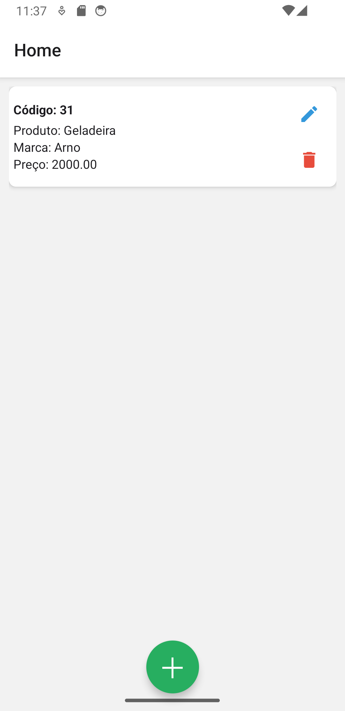
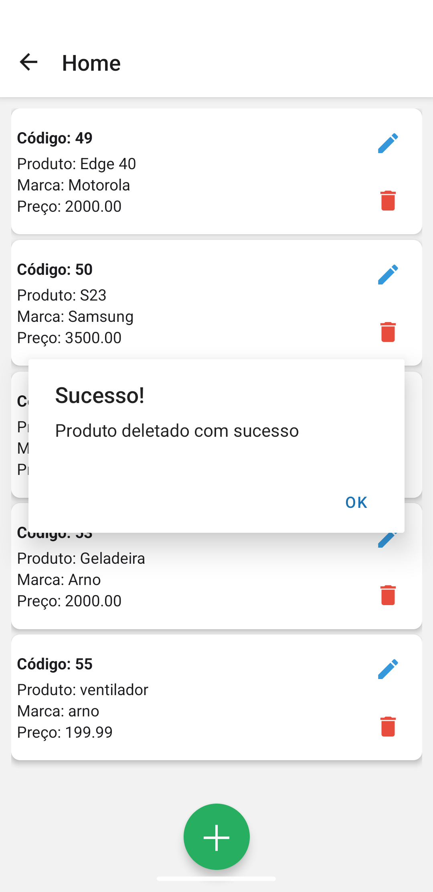
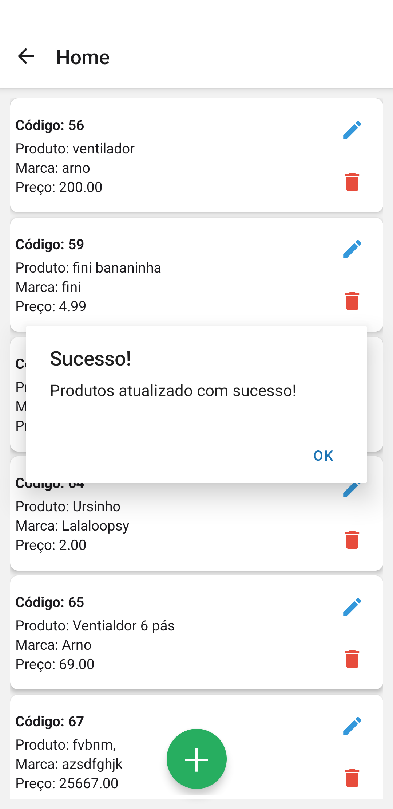

# apiEstoque

App criado em sala de aula no curso de Desenvolvimento de Sistemas na escola ETEC Guarulhos

O objetivo do exercicio é criar um app capaz de fazer o metodo CRUD de um api que criamos

- Print da Home com metodo GET

- Print da metodo DELETE

- Print do metedo POST

- Print do metedo UPDATE
